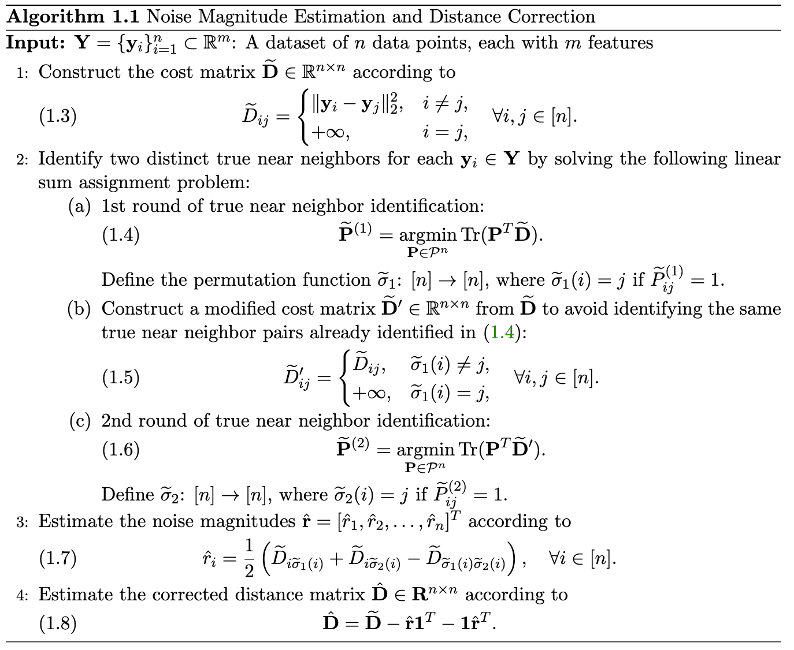

# Distance Deflation
This repository implements the algorithm from: **[Euclidean Distance Deflation under High-Dimensional Heteroskedastic Noise](https://arxiv.org/abs/2507.18520)**

The algorithm estimates noise magnitudes and corrects pairwise distances in high-dimensional datasets corrupted by heteroskedastic noise. Notably, it is hyperparameter-free and does not require prior knowledge of the clean data structure or noise distribution, nor does it rely on restrictive assumptions. The workflow is as follow: 

